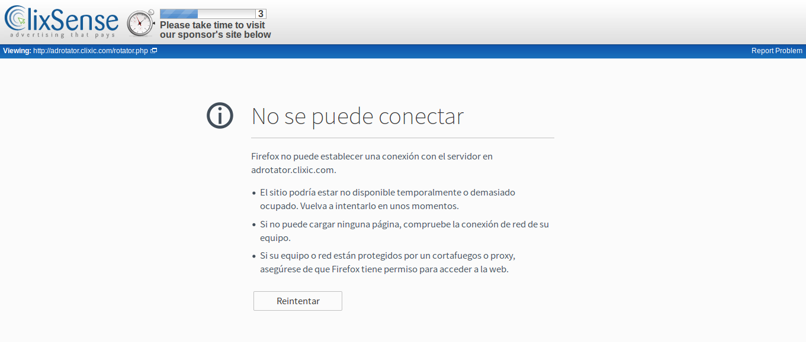

# Block ads for Clixsense

## Notes

* Block ads of clixsense made for linux.
* It can be adapted for Windows also :tophat:.

## Install or remove
For install first you need to download [Download the .zip](https://github.com/Wikelx/hosts-clixsense/archive/master.zip).

### Linux
```json
Install
$  chmod +x Install-blockAds.sh
$ ./Install-blockAds.sh

Remove

$ chmod +x Remove-blockAds.sh
$ ./Remove-blockAds.sh

```
### Windows
```json
1.- Open file "C:/windows/system32/etc/host"
2.- Open hosts-clixsense and copy from "# Ad blocking hosts ....." until the end
3.- Paste(add) under the file host and save
```
## Screenshots

